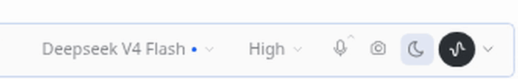
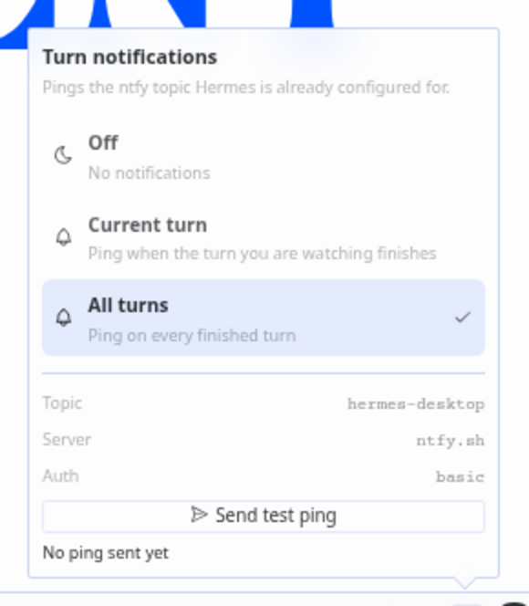

# Turn Bell

A bell in the Hermes desktop composer that pings you when a turn finishes, over the ntfy topic Hermes is already configured for. Nothing to set up.



## Install

```bash
cd ~/.hermes/desktop-plugins
git clone https://github.com/BrokeSkill/turn-bell
cd turn-bell && bash install.sh
```

Restart the desktop app and the bell is in the composer row.

## Usage

Click the bell to cycle modes, hold it for half a second to open the status panel.



| Mode | Icon | Pings |
| --- | --- | --- |
| Off | moon | never |
| Current turn | bell | when the turn you are watching finishes |
| All turns | bell with a dot | on every finished turn |

The mode survives a restart.

The status panel shows the topic the ping will land on and a **Send test ping** button, so you find out whether pings can leave the machine before you walk away from it.

## The notification

The title says complete, failed, or interrupted, with the model. The body is the first line of the answer, then model, how long the turn took, and tokens in and out. A failure arrives high priority with a warning tag, so it does not read like a success in the list.

Rapid completions collapse into one message, so four turns in a row do not become four notifications.

## License

MIT. See [LICENSE](LICENSE).
